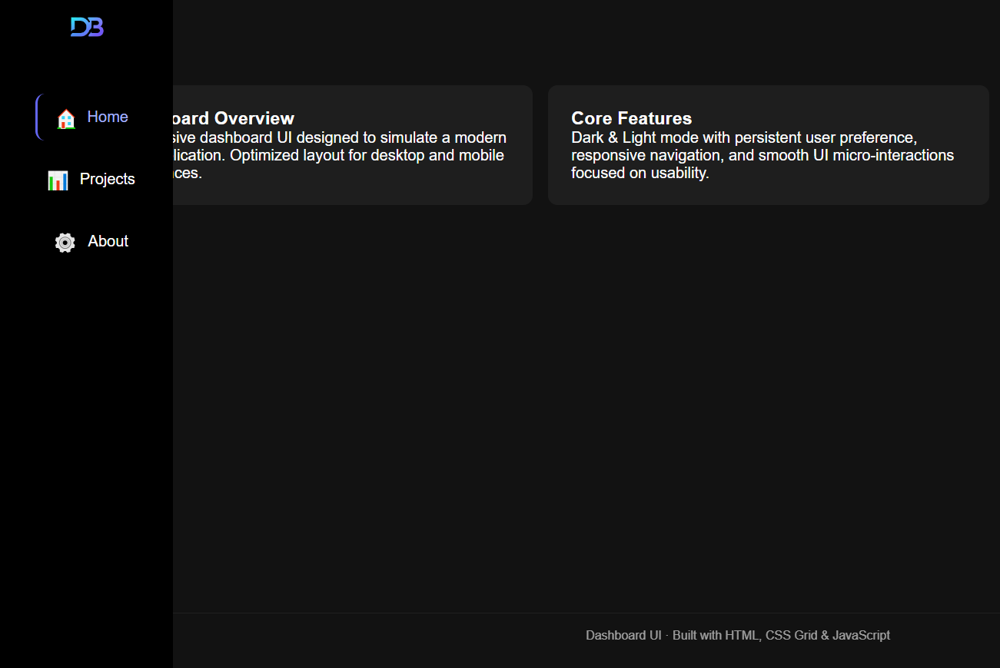

# Responsive Dashboard UI



A responsive dashboard user interface designed to simulate a modern web application layout.
The project focuses on clean UI structure, accessibility, and state management using vanilla technologies.

## ✨ Features

- Responsive sidebar navigation (desktop)
- Mobile-friendly hamburger menu
- Dark / Light mode with persistent user preference
- Automatic active state for navigation links
- CSS Grid-based dashboard layout
- Smooth micro-interactions and hover states
- Minimal, app-like footer

## 🛠 Tech Stack

- **HTML5** – Semantic structure
- **CSS3**
  - CSS Grid for layout
  - CSS variables for theming
  - Media queries for responsiveness
- **JavaScript (Vanilla)**
  - Theme toggle with `localStorage`
  - Automatic active navigation state

## 🧠 Design & UX Decisions

This project is intentionally designed as an application-style interface rather than a traditional website.

Key decisions:
- Sidebar-first navigation to mimic real dashboard environments
- Minimal visual noise to improve focus and usability
- Persistent theme preference to enhance user experience
- Hover-reveal sidebar labels to keep the UI clean but informative

## 📱 Responsive Behavior

- **Desktop**: Fixed sidebar navigation with expandable labels
- **Mobile**: Top navigation with hamburger menu
- **Layout** adapts seamlessly using CSS Grid

## 📂 Project Structure

```
/project
│── index.html
│── projects.html
│── about.html
│── style.css
│── script.js

```

## 🚀 Purpose

This project is part of a personal portfolio and demonstrates:
- UI layout reasoning
- Responsive design principles
- State handling without frameworks
- Clean, maintainable front-end code

## 🔮 Possible Improvements

- Keyboard navigation enhancements
- ARIA attributes for advanced accessibility
- Transition refinements
- Component-based refactor (future framework version)

---

No frameworks, no libraries — pure vanilla front-end.
Built with focus, curiosity, and attention to detail.
